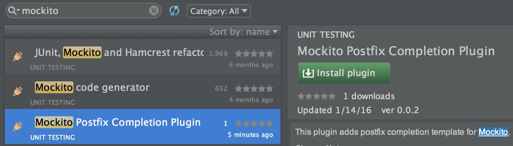
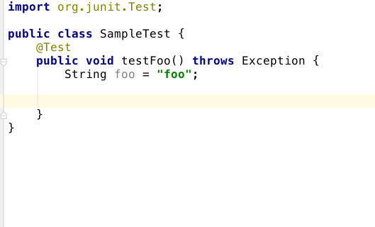

# mockito-postfix-plugin

IntelliJ plugin to add postfix completion template for [Mockito](http://mockito.org/).

This plugin is inspired by [assertj-postfix-plugin](https://github.com/tokuhirom/assertj-postfix-plugin).

## Install

https://plugins.jetbrains.com/plugin/8150



## Usage

- `mock` completion
  - `.mock` will complete `org.mockito.Mockito.mock`
- `spy` completion
  - `.spy` will complete `org.mockito.Mockito.spy`
- `when` completion
  - `.when` will complete `org.mockito.Mockito.when`
- `verify` completion
  - `.verify` will complete `org.mockito.Mockito.verify`
- `doReturn` completion
  - `.doReturn` will complete `org.mockito.Mockito.doReturn`
- `doNothing` completion
  - `.doNothing` will complete `org.mockito.Mockito.doNothing`
- `doThrow` completion
  - `.doThrow` will complete `org.mockito.Mockito.doThrow`



## Develop

```sh
./gradlew runIde
```

## LICENSE

MIT
